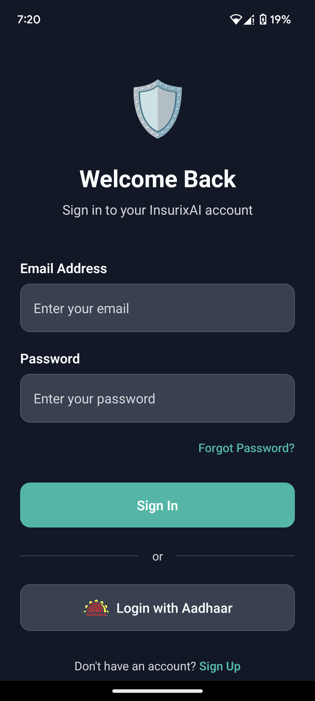
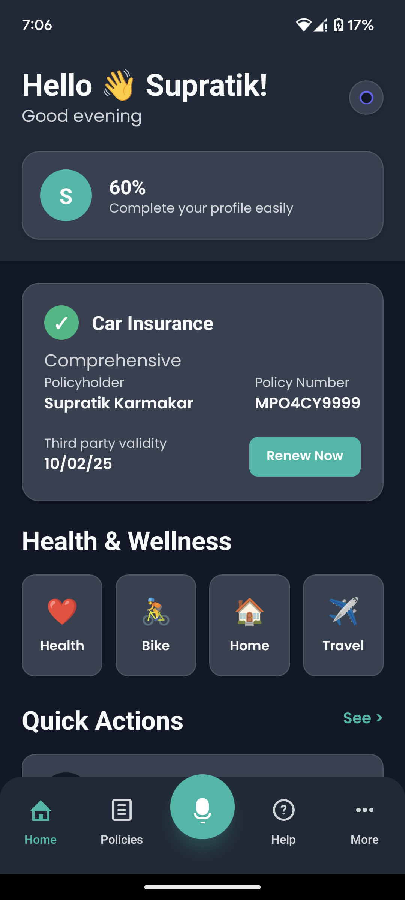
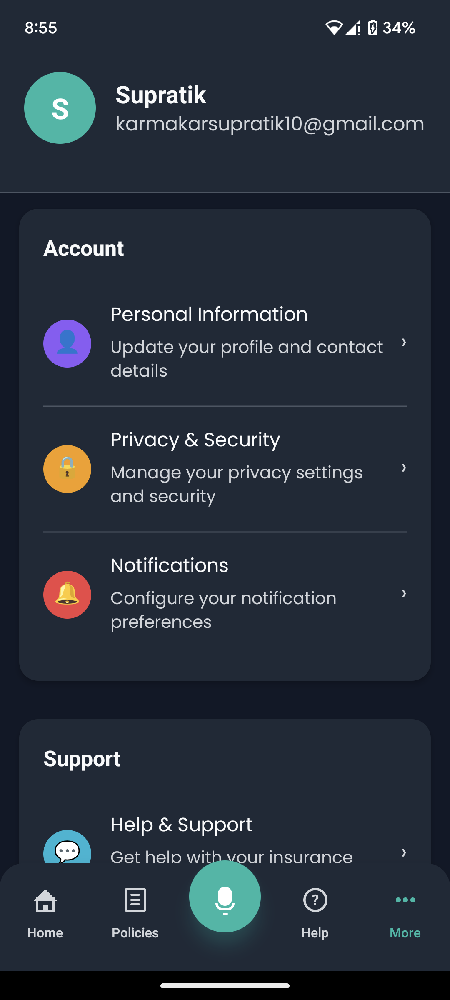
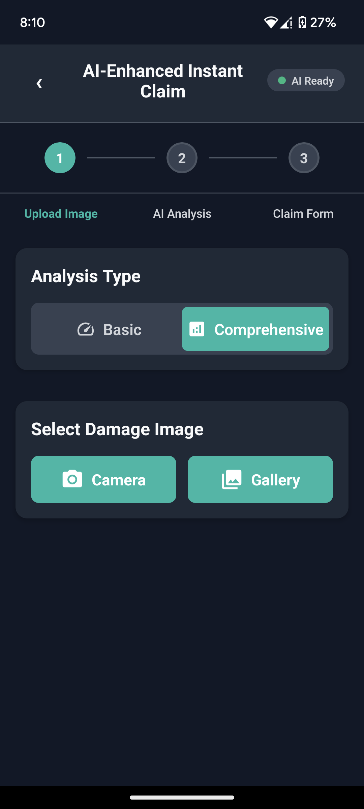
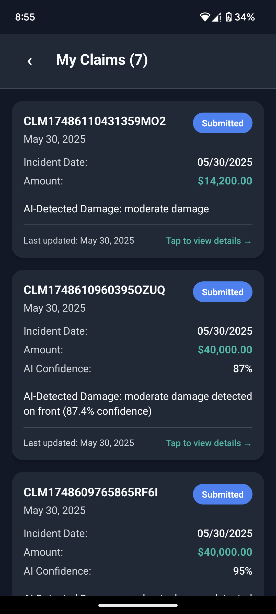

# 🛡️ InsurixAI - AI-Powered Insurance Management Platform

<div align="center">
  
  
  
  
  
  
</div>

<div align="center">
  <h3>🚗 One App. All Risks Covered</h3>
  <p><em>Instant damage detection • Automated claim processing • AI-powered assistance</em></p>
</div>

---

## 🌟 Overview

**InsurixAI** is a cutting-edge mobile insurance management platform designed to revolutionize the insurance experience in India. Built with React Native and Expo, it combines advanced machine learning models with user-friendly design to provide seamless insurance management, intelligent claim processing, and comprehensive AI-powered assistance.

### 🎯 Key Features

- **🤖 AI-Powered Damage Detection**: Advanced computer vision models analyze vehicle damage in real-time
- **📸 Instant Claim Processing**: Photo capture → AI analysis → Auto-filled claim forms in seconds
- **🎤 Voice Assistant Integration**: 24/7 AI assistant for policy management and support
- **📱 Cross-Platform Mobile App**: Native performance on iOS and Android
- **🔐 Secure Authentication**: Aadhaar-based KYC with Supabase backend
- **💾 Real-time Database**: Instant synchronization across devices
- **🎨 Modern UI/UX**: Clean, intuitive interface with dark/light theme support
- **⚡ OCR Integration**: Auto-fill forms by scanning policy documents *

---

## 🏗️ Architecture

### Frontend (React Native + Expo)
```
📱 Mobile App
├── 🎨 UI Components (React Native Paper)
├── 🧭 Navigation (Expo Router)
├── 🔄 State Management (Zustand)
├── 📡 API Integration (Axios)
├── 🎭 Theme System (Dark/Light Mode)
└── 🎤 AI Voice Assistant
```

### Backend (Python + FastAPI)
```
🐍 AI Backend
├── 🧠 TensorFlow Models (3 ML Models)
├── 🚀 FastAPI REST API
├── 📊 Damage Classification
├── 📍 Location Detection
├── 🔬 Feature Extraction
└── 🔍 OCR Processing (Tesseract) *
```

### Database (Supabase)
```
🗄️ Supabase Backend
├── 👤 User Authentication & KYC
├── 📋 Claims Management
├── 🏢 Policy Storage
├── 📊 Real-time Sync
├── 🔒 Row Level Security
└── 📁 Document Storage
```

---

## 🚀 App Flow Overview

### 1. 🎨 Splash Screen
- **Branding**: InsurixAI logo and visual identity
- **Slogan**: "*One app. All risks covered*"
- **Navigation**: "Get Started" button → Login/Sign-Up screen

### 2. 🔐 Authentication
**Login Options:**
- 📧 **Email-based registration/login**
- 🆔 **Aadhaar-based login** (via secure KYC API integration)

**Post-login**: Automatic redirect to Home Dashboard

---

## 🏠 Main Dashboard

### Top Section
```
┌─────────────────────────────────────┐
│ 🌅 Good morning, XYZ            │
│ 👤 Profile (60% complete)          │
│ 🎤 AI Assistant                    │   
└─────────────────────────────────────┘
```

**Features:**
- **Smart Greetings**: Time-based personalized messages
- **Profile Completion**: Visual progress indicator
- **AI Voice Assistant**: Accessible via microphone button

### Policy Management Card

| Field | Example |
|-------|---------|
| **Policyholder** | Rahul Sharma |
| **Policy Number** | MPO4CY9999 |
| **Third-party Validity** | 10/02/25 |
| **Policy Type** | Comprehensive |
| **Action** | 🔄 Renew Now |

### ⚡ Quick Actions
- 🚨 **Instant Claim** – Start your claim in minutes
- 🔧 **Find Local Services** – Repair shops, towing, hospitals
- 📋 **See More** – Additional quick actions

---

## 🤖 AI Models & Capabilities

### 🚗 Car Damage Classification Model
- **File**: `car_damage_classification_model.h5` (147.86 MB)
- **Purpose**: Identifies and classifies types of vehicle damage
- **Accuracy**: High-precision damage severity assessment
- **Output**: Damage categories, confidence scores

### 📍 Damage Location Detection Model  
- **File**: `ft_model_locn.h5` (120.24 MB)
- **Purpose**: Pinpoints exact location of damage on vehicle
- **Technology**: Feature-based localization
- **Output**: Spatial coordinates, affected vehicle parts

### 🔬 Feature Extraction Model
- **File**: `ft_model.h5` (120.23 MB)  
- **Purpose**: Extracts detailed visual features for analysis
- **Technology**: Deep feature learning
- **Output**: Feature vectors, damage characteristics

---

## 📷 Instant Claim Flow

### Step 1: 📸 Photo Capture/Upload
```
┌─────────────────┐    ┌─────────────────┐
│   📤 Upload     │ OR │   📸 Camera    │
│   from Device   │    │   Capture       │
└─────────────────┘    └─────────────────┘
```

### Step 2: 📝 Claim Details Form
| Field | Input Method |
|-------|-------------|
| **Policy Number** | Manual entry or OCR scan |
| **Incident Date** | Date picker |
| **Claim Amount** | Numerical input |
| **Description** | Free text |

### Step 3: 🧠 ML-Powered Assessment
**AI Processing Pipeline:**
```
📸 Photos + 📄 Data → 🤖 ML Model → 📊 Analysis Report
```

**ML Model Tasks:**
- ✅ Detect visible damages (dents, scratches, broken parts)
- 💰 Estimate claimable amount
- 📈 Calculate confidence score
- 📋 Generate structured claim request

### Step 4: ✅ Confirmation
**Success Flow:**
1. ✅ Verification passed
2. 🎉 Animated success indicator
3. 📋 Navigate to Claim History

---

## 🔌 OCR Integration

### Auto-Fill Feature
```
📄 Scan Policy Document → 🔍 OCR Processing → 📝 Auto-populate Fields
```

**Supported Documents:**
- Insurance policy documents
- Vehicle registration certificates
- Previous claim documents

---

## 🚀 API Endpoints

### Core Endpoints
| Method | Endpoint | Description |
|--------|----------|-------------|
| `GET` | `/` | Welcome message |
| `GET` | `/health` | API health check |
| `POST` | `/predict-damage` | Damage classification |
| `POST` | `/predict-location` | Location detection |
| `POST` | `/extract-features` | Feature extraction |
| `POST` | `/comprehensive-analysis` | Full AI analysis |

### ML Integration Example

#### Damage Prediction Request
```http
POST /api/v1/predict-damage
Content-Type: application/json

{
  "images": ["base64_img1", "base64_img2"],
  "policyNumber": "MPO4CY9999",
  "incidentDate": "2025-05-25",
  "vehicleDetails": {
    "make": "Honda",
    "model": "City",
    "year": 2020
  }
}
```

#### Response Format
```json
{
  "status": "success",
  "damageAssessment": {
    "overallScore": 0.85,
    "damageTypes": ["front_bumper_dent", "headlight_crack"],
    "estimatedCost": 15000,
    "confidence": 0.92,
    "claimable": true,
    "affected_parts": ["Front Bumper", "Hood"],
    "severity": "Medium",
    "recommended_action": "Repair recommended"
  },
  "processingTime": "2.3s"
}
```

---

## 🛠️ Tech Stack

### Frontend Stack
- **React Native** 0.74.5 with TypeScript
- **Expo** 51.0 with Expo Router
- **UI Framework**: React Native Paper
- **Styling**: NativeWind
- **State Management**: Zustand
- **Forms**: React Hook Form

### Backend & AI Stack
- **Database**: Supabase (PostgreSQL)
- **Authentication**: Supabase Auth with Row Level Security
- **AI Processing**: FastAPI + TensorFlow
- **OCR**: Tesseract.js
- **Image Processing**: OpenCV
- **Voice AI**: DeepSeek API *

### Development Tools
- **Navigation**: Expo Router (file-based)
- **Testing**: Jest + React Native Testing Library
- **Build**: EAS Build
- **Deployment**: EAS Submit

---

## 🗄️ Database Schema (Supabase)

### 📊 Core Tables

#### 1. `users` - User Authentication & Profile
```sql
CREATE TABLE users (
  id UUID DEFAULT gen_random_uuid() PRIMARY KEY,
  email VARCHAR(255) UNIQUE NOT NULL,
  phone VARCHAR(15) UNIQUE,
  full_name VARCHAR(100) NOT NULL,
  aadhaar_number VARCHAR(12) UNIQUE,
  pan_number VARCHAR(10) UNIQUE,
  date_of_birth DATE,
  address JSONB,
  profile_picture_url TEXT,
  kyc_status VARCHAR(20) DEFAULT 'pending',
  profile_completion_percentage INTEGER DEFAULT 0,
  created_at TIMESTAMP WITH TIME ZONE DEFAULT NOW(),
  updated_at TIMESTAMP WITH TIME ZONE DEFAULT NOW(),
  is_active BOOLEAN DEFAULT true
);
```

#### 2. `insurance_policies` - Policy Management
```sql
CREATE TABLE insurance_policies (
  id UUID DEFAULT gen_random_uuid() PRIMARY KEY,
  user_id UUID REFERENCES users(id) ON DELETE CASCADE,
  policy_number VARCHAR(50) UNIQUE NOT NULL,
  policy_type VARCHAR(30) NOT NULL,
  provider_name VARCHAR(100) NOT NULL,
  policy_holder_name VARCHAR(100) NOT NULL,
  premium_amount DECIMAL(10,2),
  coverage_amount DECIMAL(12,2),
  policy_start_date DATE NOT NULL,
  policy_end_date DATE NOT NULL,
  premium_due_date DATE,
  asset_details JSONB,
  policy_status VARCHAR(20) DEFAULT 'active',
  policy_document_url TEXT,
  auto_renewal BOOLEAN DEFAULT false,
  created_at TIMESTAMP WITH TIME ZONE DEFAULT NOW(),
  updated_at TIMESTAMP WITH TIME ZONE DEFAULT NOW()
);
```

#### 3. `claims` - Claim Management with ML Integration
```sql
CREATE TABLE claims (
  id UUID DEFAULT gen_random_uuid() PRIMARY KEY,
  user_id UUID REFERENCES users(id) ON DELETE CASCADE,
  policy_id UUID REFERENCES insurance_policies(id) ON DELETE CASCADE,
  claim_number VARCHAR(50) UNIQUE NOT NULL,
  incident_date DATE NOT NULL,
  incident_description TEXT NOT NULL,
  incident_location JSONB,
  claimed_amount DECIMAL(10,2) NOT NULL,
  estimated_amount DECIMAL(10,2),
  approved_amount DECIMAL(10,2),
  claim_status VARCHAR(30) DEFAULT 'submitted',
  priority_level VARCHAR(10) DEFAULT 'medium',
  -- ML Analysis Fields
  ml_damage_score DECIMAL(3,2),
  ml_confidence DECIMAL(3,2),
  damage_types JSONB,
  affected_parts JSONB,
  -- Processing
  reviewer_id UUID REFERENCES users(id),
  review_notes TEXT,
  settlement_date DATE,
  created_at TIMESTAMP WITH TIME ZONE DEFAULT NOW(),
  updated_at TIMESTAMP WITH TIME ZONE DEFAULT NOW()
);
```

---

## 🎤 AI Assistant Capabilities

### Core Functions
- 🗣️ **Policy Management**: Add new policies via voice commands
- 📚 **Education**: Explain complex insurance terms in simple language
- 📊 **Tracking**: Provide real-time claim status updates
- 🗺️ **Location Services**: Find nearest garages, hospitals, service centers
- 💬 **Support**: 24/7 customer assistance in multiple languages

### Voice Commands Examples
```
"Add my new car insurance policy"
"What's the status of my claim MPO4CY9999?"
"Find the nearest authorized repair shop"
"Explain comprehensive vs third-party insurance"
"Show me my policy renewal dates"
"Help me file a claim for vehicle damage"
```

---

## 🚀 Quick Start

### Prerequisites
- **Node.js** 18+ with npm/yarn
- **Python** 3.8+ (for AI backend)
- **Expo CLI**: `npm install -g @expo/cli`
- **Git LFS**: For handling large ML model files
- **Supabase Account**: For database & authentication
- **DeepSeek API Key**: For AI processing

### 1️⃣ Clone Repository
```bash
git clone https://github.com/supratikkarmakr/InsurixAI.git
cd InsurixAI
```

### 2️⃣ Install Dependencies
```bash
# Install mobile app dependencies
npm install

# Setup Python API environment
cd api
python -m venv venv

# Windows
venv\Scripts\activate
# macOS/Linux  
source venv/bin/activate

# Install Python dependencies
python install_dependencies.py
```

### 3️⃣ Environment Configuration
```bash
# Copy environment template
cp env.example .env

# Edit .env with your credentials
```

**Required Environment Variables:**
```env
# Supabase Configuration
EXPO_PUBLIC_SUPABASE_URL=your_supabase_project_url
EXPO_PUBLIC_SUPABASE_ANON_KEY=your_supabase_anon_key

# DeepSeek AI
DEEPSEEK_API_KEY=your_deepseek_api_key

# External Services (Optional)
GOOGLE_MAPS_API_KEY=your_google_maps_key
EXPO_PUBLIC_APP_ENV=development
```

### 4️⃣ Start Services

**Backend API:**
```bash
cd api
python start_api.py
# API runs at http://localhost:8000
```

**Mobile App:**
```bash
npm start
# Choose your platform: iOS, Android, or Web
```

---

## 📱 App Screens

### 🏠 Core Screens
- **Home Dashboard**: Policy overview, quick actions, AI assistant
- **Instant Claim**: AI-powered photo analysis and claim submission
- **My Claims**: Real-time claim tracking and status updates  
- **Profile**: User settings, policy management, claim history
- **Local Services**: Find nearby garages, hospitals, towing services

### 🔐 Authentication Flow
- **Login/Register**: Secure Supabase authentication
- **Onboarding**: Feature introduction and setup
- **KYC Verification**: Aadhaar-based identity verification
- **Profile Setup**: Personal and policy information

---

## 📸 App Screenshots

<div align="center">

### 🎨 Splash Screen & Authentication

&nbsp;&nbsp;&nbsp;&nbsp;


*Elegant onboarding experience with "One app. All risks covered" tagline and secure authentication options including Aadhaar integration*

---

### 🏠 Home Dashboard & Profile

&nbsp;&nbsp;&nbsp;&nbsp;


*Personalized dashboard with smart greetings, policy overview, and comprehensive profile management with 60% completion tracking*

---

### 🤖 AI-Enhanced Instant Claim

&nbsp;&nbsp;&nbsp;&nbsp;


*Revolutionary AI-powered claim processing with comprehensive analysis types and detailed claim tracking with confidence scores*

</div>

### ✨ Key UI Features Showcased

#### 🎨 **Modern Dark Theme Design**
- Sleek dark interface with teal accent colors
- Professional typography and spacing
- Intuitive iconography and visual hierarchy

#### 🔄 **Smart Progress Tracking**
- Step-by-step claim submission flow (1→2→3)
- Real-time AI analysis status indicators
- Profile completion percentage with visual feedback

#### 🤖 **AI Integration Highlights**
- "AI Ready" status indicators
- Comprehensive vs Basic analysis options
- ML confidence scores (87%, 95%) displayed prominently
- Real-time damage detection results

#### 📊 **Data-Rich Interfaces**
- Detailed claim information with amounts ($14,200, $40,000)
- Policy details with renewal dates and validity periods
- Comprehensive insurance portfolio (Health, Bike, Home, Travel)

#### 🎯 **User-Centric Navigation**
- Bottom tab navigation with microphone for AI assistant
- Quick actions prominently displayed
- "Tap to view details" interactive elements

---

## 🛠️ Development

### Project Structure
```
InsurixAI/
├── 📱 app/                     # Expo Router screens
│   ├── (auth)/                 # Authentication flow
│   ├── (tabs)/                 # Main tab navigation
│   ├── instant-claim.tsx       # Standard claim screen
│   └── instant-claim-enhanced.tsx # AI-enhanced version
│
├── 🧩 components/              # Reusable UI components
│   ├── DamageDetector.tsx      # AI damage detection
│   └── ThemeToggle.tsx         # Dark/light mode toggle
│
├── 🔧 src/                     # Core application logic
│   ├── services/               # API and external integrations
│   ├── stores/                 # Zustand state management
│   ├── types/                  # TypeScript definitions
│   ├── utils/                  # Helper functions
│   └── config/                 # App configuration
│
├── 🐍 api/                     # Python FastAPI backend
│   ├── app/                    # FastAPI application
│   ├── models/                 # ML model files (Git LFS)
│   └── requirements.txt        # Python dependencies
│
├── 📚 docs/                    # Documentation
└── 📋 config files             # App configuration
```

### 🧪 Testing
```bash
# Run frontend tests
npm test

# Test API endpoints
curl http://localhost:8000/health

# Test AI models
curl -X POST http://localhost:8000/predict-damage \
  -F "file=@test-image.jpg"
```

---

## 🔧 Configuration

### ML Model Setup
The app uses Git LFS to manage large ML model files:
```bash
# Models are automatically downloaded via Git LFS
git lfs pull

# Verify models exist:
ls -la api/models/
```

### Environment Variables
```bash
# Supabase Configuration
EXPO_PUBLIC_SUPABASE_URL=your_supabase_url
EXPO_PUBLIC_SUPABASE_ANON_KEY=your_anon_key

# App Configuration  
APP_ENV=development
```

---

## 📊 Features in Detail

### 🤖 AI-Powered Claims Processing
1. **Photo Capture**: High-resolution image capture with camera optimization
2. **AI Analysis**: Multi-model ensemble for comprehensive damage assessment
3. **Smart Form Filling**: Automatic population of claim forms based on AI analysis
4. **Confidence Scoring**: Reliability metrics for each AI prediction
5. **Human Review**: Flagging system for cases requiring manual review

### 📱 Mobile Experience
- **Offline Support**: Core functionality works without internet
- **Real-time Sync**: Automatic cloud synchronization when connected
- **Push Notifications**: Claim status updates and reminders
- **Accessibility**: Full screen reader and accessibility support
- **Performance**: Optimized for smooth 60fps animations

### 🔒 Security & Privacy
- **End-to-End Encryption**: All sensitive data encrypted in transit
- **Secure Storage**: Local data protection with device encryption
- **GDPR Compliance**: User data rights and privacy controls
- **Audit Logs**: Comprehensive activity tracking
- **Role-Based Access**: Granular permission system

---

## 🚀 Deployment

### Mobile App (EAS Build)
```bash
# Build for iOS
npx eas build --platform ios

# Build for Android  
npx eas build --platform android

# Submit to stores
npx eas submit
```

### Backend API
```bash
# Using Docker
docker build -t insurixai-api .
docker run -p 8000:8000 insurixai-api

# Or deploy to cloud platforms:
# - Heroku, Railway, Google Cloud Run
# - AWS Lambda with Serverless Framework
```

---

## 🚀 Future Enhancements

### Phase 2 Features
- 🏛️ **Government Integration**: IRDAI API connectivity
- 🆔 **Enhanced KYC**: PAN/Aadhaar eKYC verification
- 🔍 **Insurance Marketplace**: Real-time policy comparison engine
- 🌐 **Localization**: Multi-language support (Hindi, Tamil, Bengali, etc.)

### Phase 3 Features
- 💳 **Payment Gateway**: In-app premium payments
- 🔔 **Smart Notifications**: Renewal reminders and alerts
- 📈 **Analytics Dashboard**: Personal insurance insights
- 🤝 **Partner Network**: Integration with hospitals, garages, and service providers

---

## 🤝 Contributing

We welcome contributions! Please follow these steps:

1. **Fork** the repository
2. **Create** a feature branch (`git checkout -b feature/amazing-feature`)
3. **Commit** your changes (`git commit -m 'Add amazing feature'`)
4. **Push** to the branch (`git push origin feature/amazing-feature`)
5. **Open** a Pull Request

### Development Guidelines
- Follow the existing code style and conventions
- Add tests for new features
- Update documentation as needed
- Ensure all tests pass before submitting

---

## 👥 Authors

- **Supratik Karmakar** - *Lead Developer* - [@supratikkarmakr](https://github.com/supratikkarmakr)
- **Sohani Hazra** - *Frontend Developer* - [@Sohani Hazra](https://github.com/soho-star)
- **Chandrima Nandi** - *ML Developer* - [@ChandrimaNandi](https://github.com/ChandrimaNandi)

---


## 🙏 Acknowledgments

- **Expo Team** - For the excellent React Native framework
- **Supabase** - For the powerful backend-as-a-service platform  
- **TensorFlow** - For the machine learning capabilities
- **React Native Community** - For the amazing ecosystem
- *  *denotes that those features are undergoing*

<div align="center">
  <h3>🌟 Star this repository if you found it helpful! 🌟</h3>
  <p>Made with ❤️ for the future of insurance technology in India</p>

</div>
